# 🅿️ SmartParking – Stressfrei parken in der City
> Eine moderne Full-Stack Lösung zur Echtzeit-Parkplatzverwaltung und Reservierung.
><div align="center">
  <p>
    <a href="https://smartparking-hvafdxhgdpgjhdda.westeurope-01.azurewebsites.net/" target="_blank">
      
    </a>
</div>

[](https://nodejs.org/)
[](https://azure.microsoft.com/en-us/services/cosmos-db/)
[](https://tailwindcss.com/)

SmartParking ist eine interaktive Web-Anwendung, die Autofahrern dabei hilft, freie Parkplätze in Echtzeit zu finden und sofort zu reservieren. Entwickelt mit Fokus auf Performance, Skalierbarkeit und eine intuitive User Experience.

---

## 📸 Einblick in die App
*(Tipp: Hier ein Screenshot oder ein kurzes GIF deiner App einfügen!)*

---

## 🚀 Kern-Features
* **Live-Karte:** Interaktive Übersicht aller Standorte via **Leaflet.js** und OpenStreetMap.
* **Echtzeit-Status:** Dynamische Berechnung der verfügbaren Plätze direkt aus der **Azure Cosmos DB**.
* **Smart Cards:** Detaillierte Listenansicht mit Bildern, Preisangaben und Kurzbeschreibungen.
* **One-Click Reservation:** Angemeldete Nutzer können ihren Parkplatz mit einem Klick sichern.
* **Responsive Design:** Dank **Tailwind CSS** auf dem Smartphone genauso flüssig wie auf dem Desktop.

---

## 🛠️ Der Tech-Stack
### Frontend
- **EJS (Embedded JavaScript):** Für dynamisches Templating.
- **Tailwind CSS:** Utility-first CSS für ein modernes UI.
- **Leaflet.js:** Integration interaktiver Karten.

### Backend
- **Node.js & Express:** Robuste Server-Architektur.
- **Azure Cosmos DB:** Hochverfügbare NoSQL-Datenbank für Parkplatz- und Userdaten.
- **Express-Session:** Sicheres Handling von Nutzersitzungen.

---

## 🧠 Herausforderungen & Lösungen (Dev-Log)
Dieses Projekt war mehr als nur "Standard-Code". Hier sind zwei technische Hürden, die ich gemeistert habe:

1. **Tailwind JIT & Dynamisches HTML:**
   Da die Parkplatz-Karten dynamisch über JavaScript-Strings generiert werden, erkannte der Tailwind-Compiler die CSS-Klassen anfangs nicht (über 30 Layout-Fehler).
   *Lösung:* Anpassung der `tailwind.config.js` (`content`-Pfad), um auch JS-Dateien im `public`-Ordner zu scannen.
   
2. **Asynchrone Datenverarbeitung:**
   Die parallele Darstellung von Karten-Markern und der Listenansicht erforderte ein sauberes State-Management im Frontend, um Ladezeiten unter 200ms zu halten.

---

## ⚙️ Installation & Setup

1. **Repository klonen:**
   ```bash
   git clone [https://github.com/DEIN_PROFIL/smart-parking.git](https://github.com/DEIN_PROFIL/smart-parking.git)
   cd smart-parking


---   
# 🅿️ SmartParking – Bildervorschau wenn die Webseite nicht klappt
> Die intelligente Full-Stack Lösung zur Echtzeit-Parkplatzsuche, Reservierung und Abrechnung.

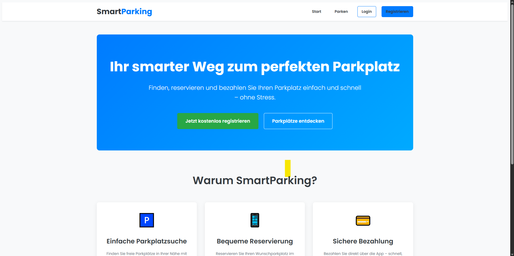


---

## 🌟 Kern-Features & Einblick

Hier bekommen Sie einen detaillierten Einblick in die Funktionen der SmartParking App, von der Registrierung bis zur abgeschlossenen Rechnung.

### 1. User Onboarding & Kontobereich
Ein reibungsloser Start und eine klare Übersicht über Ihre persönlichen Daten.

| Registrierung | Login | Mein Kontobereich |
| :---: | :---: | :---: |
| 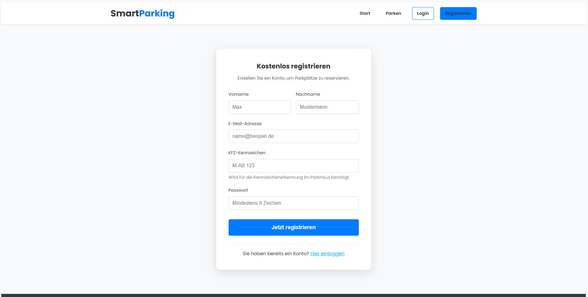 | 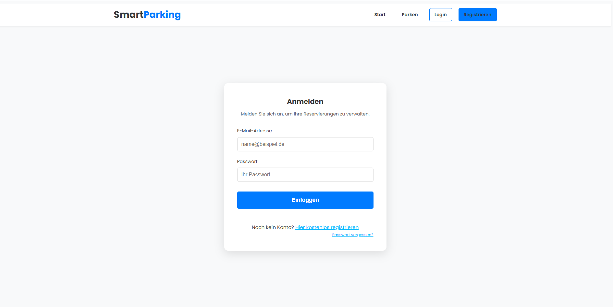 | 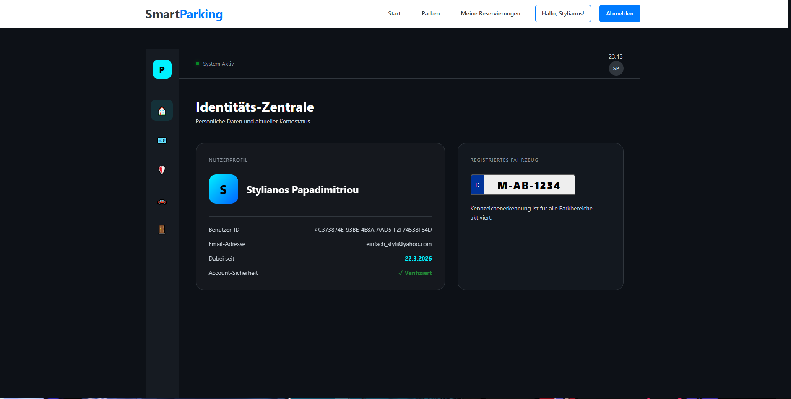 |

---

### 2. Parkplatzsuche & Reservierung
Finden Sie den perfekten Spot in Echtzeit und sichern Sie ihn sich sofort.

**Die Standort-Übersicht:**
Wählen Sie Ihren bevorzugten Parkplatz direkt von der Karte oder der Liste.


**Details & Buchung:**
Detaillierte Infos zu freien Plätzen, Preisen und Reservierungsoptionen.
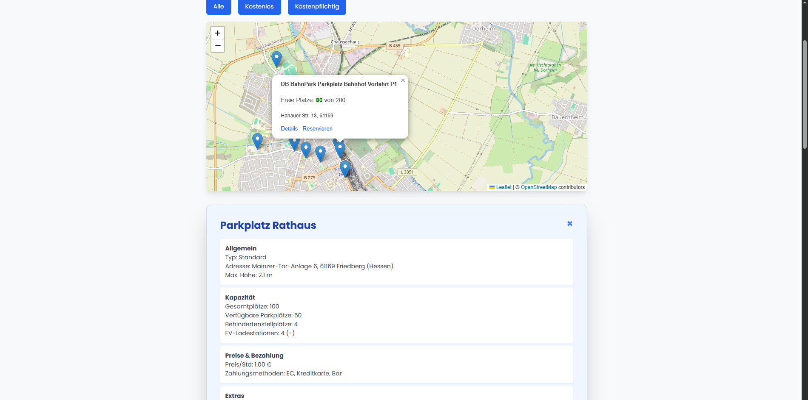

---

### 3. Historie & Abrechnung
Volle Transparenz über Ihre vergangenen Parkvorgänge und Rechnungen.

**Mein Parkverlauf:**
Übersicht über alle abgeschlossenen und aktiven Reservierungen.
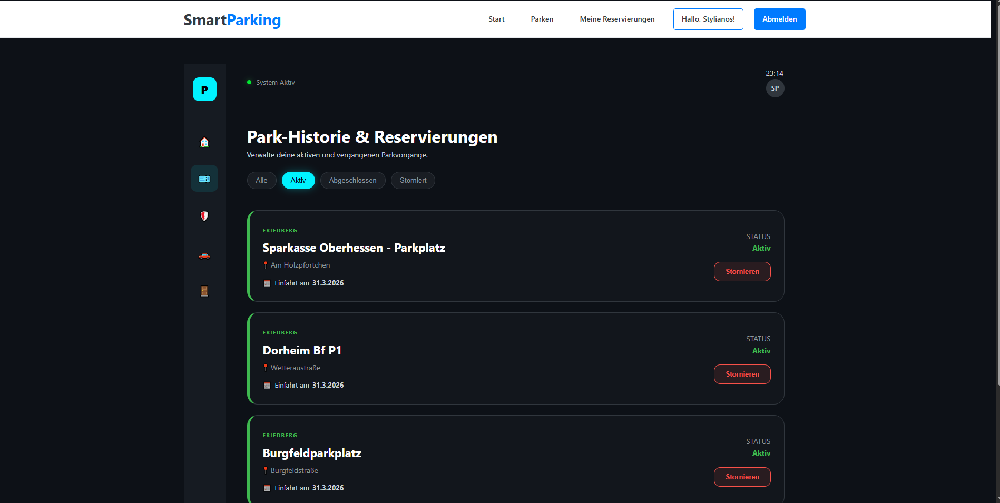

**Rechnungsansicht:**
Detaillierte Rechnung zu jeder abgeschlossenen Reservierung.
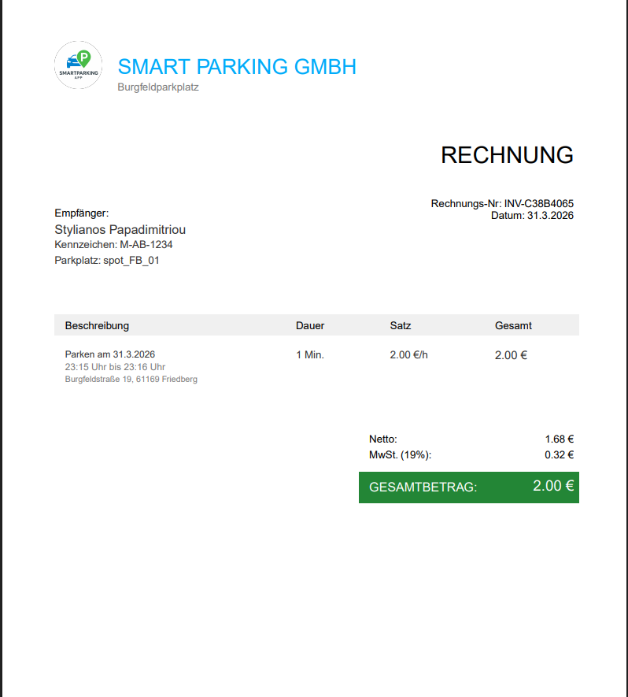

---

### 4. Admin & Backoffice (Simulations-Szenarien)
Einblicke in die Backend-Verwaltung und die Simulation von Parkvorgängen.

**Zutritts-Simulation:**
Simulation der Ein- und Ausfahrt-Schranken, die den Belegungsstatus in Echtzeit aktualisieren.
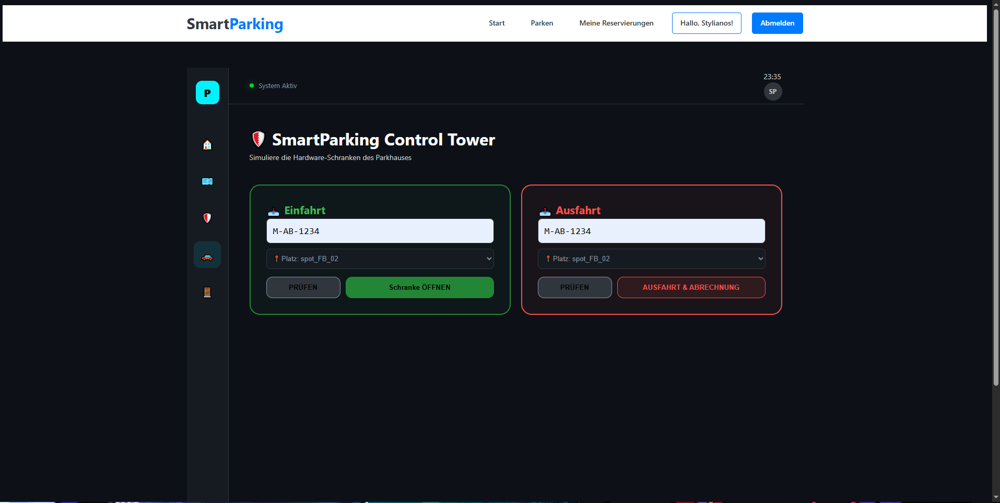

**Dashboard & Datenansicht:**
Statistiken und die direkte Sicht auf die Cosmos DB (Vorschau).
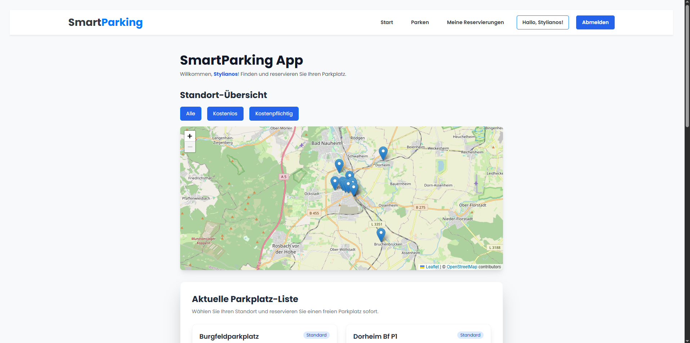
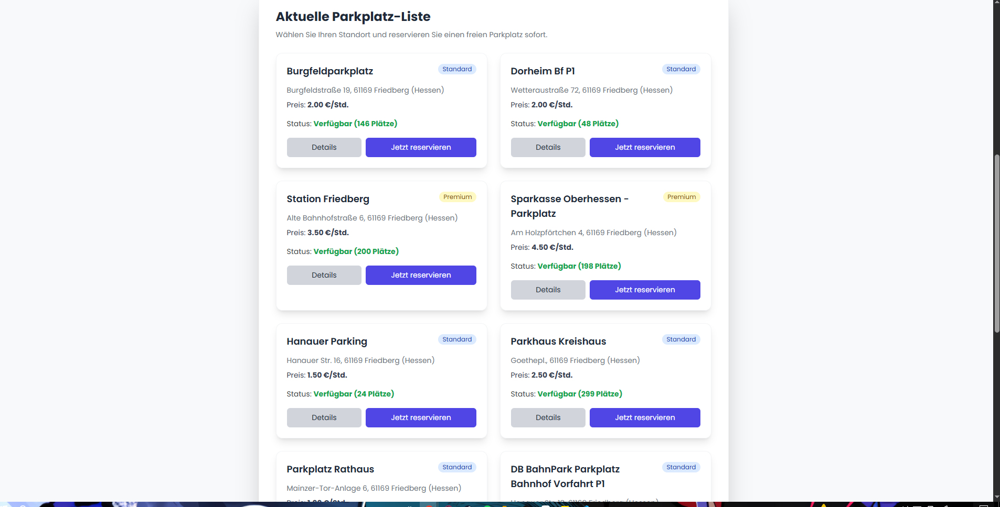
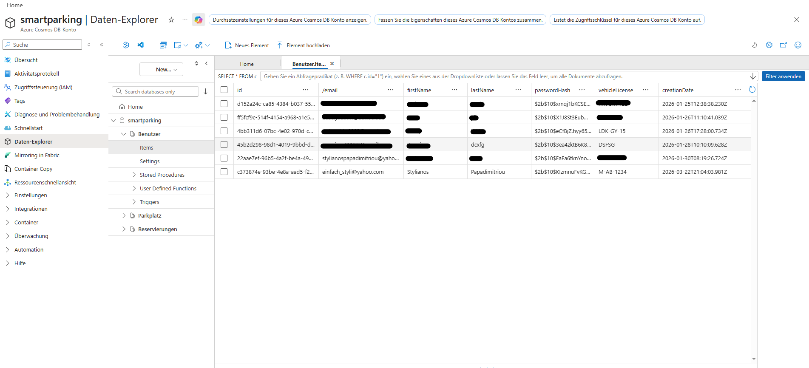

